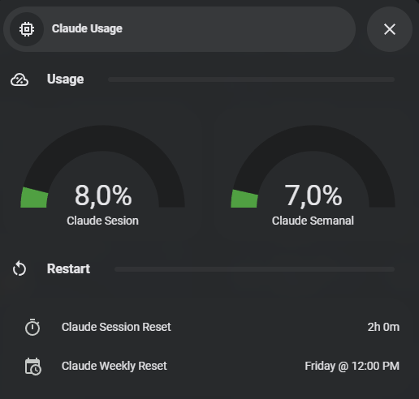

# Claude Pulse

> **Monitor your Claude.ai usage limits directly from Home Assistant.**

[](https://github.com/hacs/integration)
[](https://github.com/nikolmedo/ClaudePulse/releases)
[](https://github.com/nikolmedo/ClaudePulse/actions/workflows/main.yml)
[](LICENSE)

Claude Pulse is a [Home Assistant](https://www.home-assistant.io/) custom integration that exposes your [Claude.ai](https://claude.ai) **session (5-hour)** and **weekly (7-day)** usage as native sensors — so you always know how much Claude you have left before hitting a limit, right from your dashboard.



---

## ✨ Features

- 📊 **Session usage** — percentage of your 5-hour window, plus a live countdown to the next reset
- 📅 **Weekly usage** — percentage of your 7-day window, plus reset day and time
- 🔄 **Auto-refresh** — polls Claude.ai every 2 minutes by default (configurable, 30s minimum)
- 🔐 **Built-in re-authentication** — Home Assistant notifies you when your session key expires and guides you through renewing it
- 🧩 **Fully UI-based setup** — config flow with live credential validation, no YAML required
- 🛰️ **10 sensors** — every data point exposed as an individual Home Assistant entity, grouped under one device

---

## 🚀 Installation

Claude Pulse is available in the **default HACS store**.

[](https://my.home-assistant.io/redirect/hacs_repository/?owner=nikolmedo&repository=ClaudePulse&category=integration)

### Via HACS (recommended)

1. Click the button above, **or** open **HACS** in your Home Assistant sidebar and search for **Claude Pulse**
2. Click **Download** and confirm
3. **Restart Home Assistant**
4. Go to **Settings → Devices & Services → Add Integration** and search for **Claude Pulse**
5. Enter your **Session Key** and **Organization ID** ([how to get them](#-getting-your-credentials))

### Manual installation

1. Download the latest [release](https://github.com/nikolmedo/ClaudePulse/releases)
2. Copy the `custom_components/claude_pulse` folder into your Home Assistant `config/custom_components/` directory
3. Restart Home Assistant and add the integration as in steps 4–5 above

> Requires Home Assistant **2024.1.0** or newer.

---

## 🔑 Getting your credentials

### Session Key

1. Open [claude.ai](https://claude.ai) in your browser and log in
2. Open DevTools (`F12`) → **Application** → **Cookies** → `https://claude.ai`
3. Copy the value of the `sessionKey` cookie

### Organization ID

1. Still in DevTools, open the **Network** tab and reload the page
2. Find any request whose URL contains `/api/organizations/`
3. Copy the UUID from that URL (format: `xxxxxxxx-xxxx-xxxx-xxxx-xxxxxxxxxxxx`)

> ⚠️ Your session key is a credential — treat it like a password. It is stored only inside your Home Assistant instance and is sent exclusively to `claude.ai`.

---

## 📟 Available sensors

All entities are grouped under a single **Claude Pulse** device:

| Entity | Description | Unit |
|--------|-------------|------|
| `sensor.claude_pulse_session_usage` | Session usage (5-hour window) | % |
| `sensor.claude_pulse_weekly_usage` | Weekly usage (7-day window) | % |
| `sensor.claude_pulse_session_reset_countdown` | Time until the session resets (e.g. `2h 30m`) | — |
| `sensor.claude_pulse_session_reset_time` | Clock time of the next session reset | — |
| `sensor.claude_pulse_weekly_reset` | Weekly reset summary (e.g. `Friday @ 03:45 AM`) | — |
| `sensor.claude_pulse_weekly_reset_weekday` | Day of the week of the weekly reset | — |
| `sensor.claude_pulse_weekly_reset_time` | Clock time of the weekly reset | — |
| `sensor.claude_pulse_session_used` | Session used (alias of session usage) | % |
| `sensor.claude_pulse_session_limit` | Session limit (always 100) | % |
| `sensor.claude_pulse_plan` | Subscription plan (diagnostic) | — |

> Exact entity IDs may vary depending on the device name Home Assistant assigns. Find yours in **Developer Tools → States** filtering by `claude_pulse`.

---

## 💡 Example automation

Get notified before you burn through your session:

```yaml
automation:
  - alias: "Claude session almost exhausted"
    trigger:
      - platform: numeric_state
        entity_id: sensor.claude_pulse_session_usage
        above: 80
    action:
      - service: notify.mobile_app_your_phone
        data:
          title: "Claude Pulse ⚠️"
          message: >
            Claude session at {{ states('sensor.claude_pulse_session_usage') }}%.
            Resets in {{ states('sensor.claude_pulse_session_reset_countdown') }}.
```

---

## ⚙️ Configuration options

After setup, click **Configure** on the integration to change:

| Option | Description | Default |
|--------|-------------|---------|
| Session Key | Your `sessionKey` cookie from claude.ai | — |
| Organization ID | Your Claude organization UUID | — |
| Update interval | Polling frequency in seconds (minimum 30) | 120 |

---

## 🩺 Troubleshooting

| Symptom | Cause & fix |
|---------|-------------|
| **Authentication failed (HTTP 401/403)** | Your `sessionKey` cookie expired. Go to **Settings → Devices & Services → Claude Pulse → Configure** and enter a new one. |
| **All endpoints return 404** | Wrong Organization ID. Verify it via DevTools → Network → requests to `/api/organizations/`. |
| **Sensors show `unavailable` after setup** | Check **Settings → System → Logs** for `claude_pulse` errors. Network errors at startup are retried automatically. |
| **Repair notification for Claude Pulse** | Session key expired. Click the notification to open the re-authentication form. |

Still stuck? [Open an issue](https://github.com/nikolmedo/ClaudePulse/issues) with your Home Assistant logs.

---

## 🗂️ Legacy / standalone setup

If you prefer not to use the integration, the original standalone files are still in the repo:

| File | Location | Description |
|------|----------|-------------|
| `claude_usage.py` | `/config/` | Python script that fetches usage from claude.ai |
| `claude_usage.yaml` | `/config/packages/` | `command_line` sensor + template sensors |

See the git history for setup instructions for this approach.

---

## 🤝 Contributing

Issues and pull requests are welcome! Every push runs [HACS](https://github.com/hacs/action) and [Hassfest](https://github.com/home-assistant/actions) validation via GitHub Actions. See [AGENTS.md](AGENTS.md) for an overview of the codebase.

---

## 📄 License

[MIT](LICENSE) — do whatever you want with it.

---

*Claude Pulse is an unofficial project and is not affiliated with Anthropic.*
